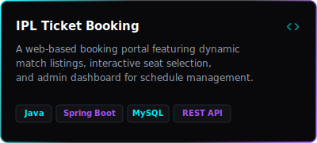
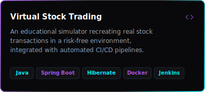

<h1 align="center">Karthik Reddy</h1>

  

  

## 📊 Analytics & Performance

<table width="100%" border="0" cellspacing="0" cellpadding="0">
  <tr>
    <td width="50%" align="center" valign="top">
      
    </td>
    <td width="50%" align="center" valign="top">
      
    </td>
  </tr>
</table>

  

## 📂 Featured Engineering

<table width="100%" border="0" cellspacing="0" cellpadding="5">
  <tr>
    <td width="50%" align="center" valign="top">
      
    </td>
    <td width="50%" align="center" valign="top">
      
    </td>
  </tr>
</table>

  

## 🛠️ Tech Ecosystem

<table width="100%" border="0" cellspacing="0" cellpadding="0">
  <tr>
    <td width="33%" valign="top">
      <h4>💻 Languages</h4>
      
      
        
      
      
        
      
    </td>
    <td width="33%" valign="top">
      <h4>⚡ Frameworks & DBs</h4>
      
      
        
      
      
        
      
    </td>
    <td width="34%" valign="top">
      <h4>🛡️ DevOps & Tools</h4>
      
      
        
      
      
        
      
      
    </td>
  </tr>
</table>

  

## 📈 Activity & Streaks

  

  

  

## 🤝 Ecosystem Connect

  
  &nbsp;
  
  &nbsp;
  
  &nbsp;
  
  &nbsp;
  

  Designed with 💜 and 🩵 by Karthik Reddy.

