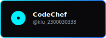

  

  

  

## 🚀 About Me

  

  

## 🛠️ Tech Ecosystem

  

  

## 💻 Coding Profiles

<table width="100%" border="0" cellspacing="0" cellpadding="5">
  <tr>
    <td width="33%" align="center" valign="top">
      
    </td>
    <td width="33%" align="center" valign="top">
      
    </td>
    <td width="34%" align="center" valign="top">
      
    </td>
  </tr>
</table>

  

