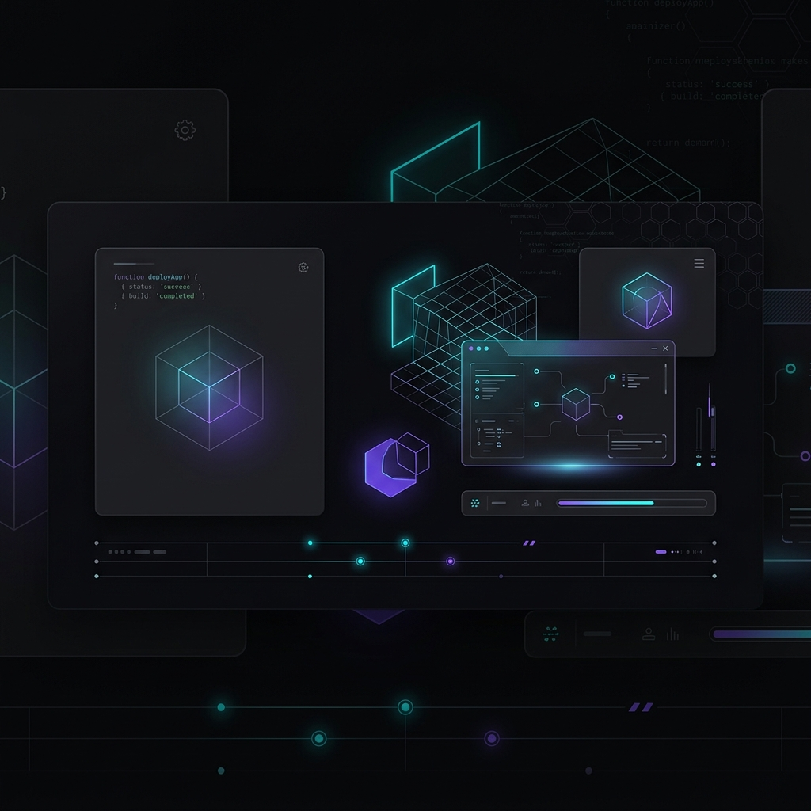

# Hi there! I'm Kommareddy Karthik Reddy 👋

  

  

---

### 💫 About Me

I am a Computer Science & Engineering student with a strong foundation in Data Structures & Algorithms (DSA), Object-Oriented Programming (OOP), and Backend Development. I love building secure, scalable cloud-native web applications and automating software development pipelines.

<table width="100%">
  <tr>
    <td valign="top" width="50%">
      <h4>🔭 Current Focus</h4>
      <ul>
        <li>🚀 Building real-world systems using **Java**, **Spring Boot**, and **Microservices**.</li>
        <li>📚 Learning advanced DevOps, **CI/CD**, and cloud architectures (**GCP/AWS**).</li>
        <li>💻 Actively practicing DSA & competitive programming on LeetCode, Codeforces, and CodeChef.</li>
        <li>🛡️ Exploring cybersecurity principles and secure backend development.</li>
      </ul>
    </td>
    <td valign="top" width="50%">
      <h4>📊 Streak Stats</h4>
      

        
      

    </td>
  </tr>
</table>
---

### 🛠️ Languages & Technologies

Here are the languages, frameworks, and tools I use to build applications:

<table>
  <tr>
    <td align="left" valign="top" width="33%">
      <strong>Languages</strong>
       
       
      
       
      
       
      
       
      
       
      
       
      
    </td>
    <td align="left" valign="top" width="33%">
      <strong>Technologies & DBs</strong>
       
       
      
       
      
       
      
       
      
       
      
    </td>
    <td align="left" valign="top" width="33%">
      <strong>Cloud, DevOps & Tools</strong>
       
       
      
       
      
       
      
       
      
       
      
       
      
    </td>
  </tr>
</table>

---

### 📂 Featured Projects

#### 🏏 [IPL Ticket Booking System](https://github.com/karthikreddi00)
* **Description:** A web-based ticket booking portal featuring dynamic match listings, interactive seat selection, user booking history, and a robust admin dashboard for pricing and schedule management.
* **Tech Stack:** Java, Spring Boot, MySQL, REST APIs
* **Key Role:** Designed and implemented security, seat reservation algorithms, and RESTful API endpoints.

#### 📈 [Virtual Stock Trading System](https://github.com/karthikreddi00)
* **Description:** An educational platform simulating stock transactions in a risk-free virtual environment, enabling users to evaluate investment strategies under realistic market behavior.
* **Tech Stack:** Java, Spring Boot, Hibernate, Docker, Jenkins
* **Key Role:** Built backend workflows, structured database mappings with Hibernate, and automated testing/deployment with Docker and CI/CD pipelines.

---

### 💻 Coding Profiles

I practice competitive programming and problem-solving to sharpen my computational skills:

  
  
  

---

### 📈 GitHub Analytics

<table width="100%">
  <tr>
    <td align="center" valign="top" width="50%">
      <h4>📊 Profile Statistics</h4>
      
    </td>
    <td align="center" valign="top" width="50%">
      <h4>💻 Top Languages Used</h4>
      
    </td>
  </tr>
</table>

---

### 🤝 Let's Connect!

I'm always open to talking about software engineering, backend systems, cloud, or new opportunities:

  
  

---

  Designed with ❤️ by Karthik Reddy.

